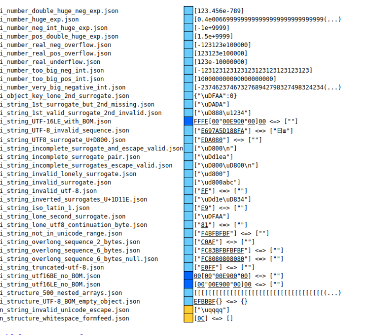
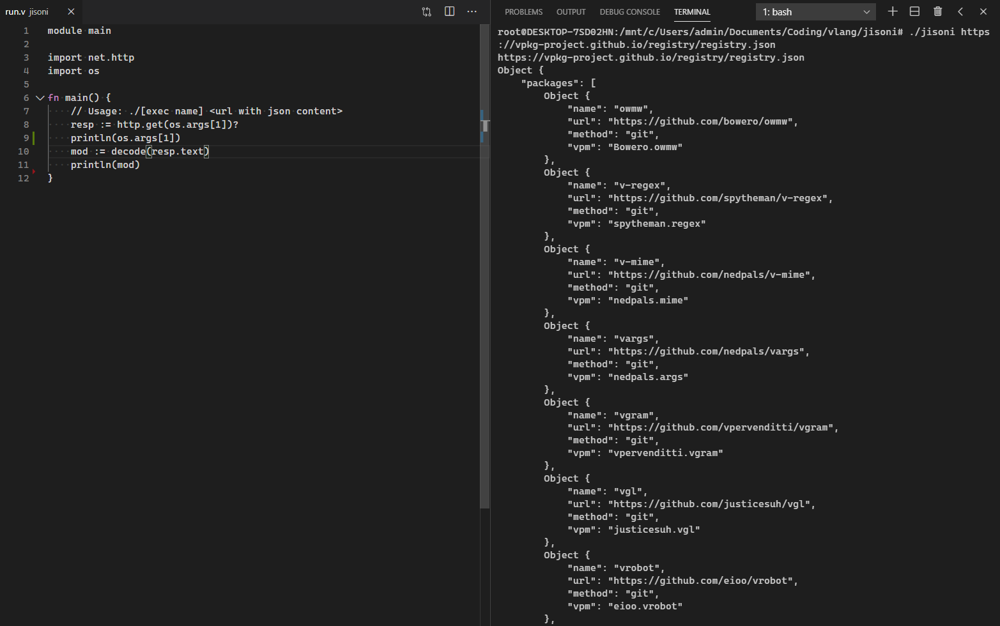

# JISONI
A work-in-progress JSON parser written on pure V. It aims to [replace CJSON](https://github.com/vlang/v/issues/309) and provides a cleaner and simple-to-use API for encoding and decoding JSON.

## Parsing Test

## Demo

## TODO
- ~~Function Organization~~
- ~~JSON Tree Navigation~~
- ~~Encoding~~
- ~~Performance~~ (Not an important issue for now) 
- Testing (Especially on JSON Test Suite)
- Error Messages (adding line numbers to message is WIP)
- ~~Parsing errors (Avoid correcting malformed/invalid ones!)~~

## License
Licensed under [MIT](LICENSE)

## Testing
1. Run `test.sh` (for Unix systems) or `test.bat` (for Windows)
2. Open `parsing.html` inside the `results/` folder of the JSON test suite. 

## Copyright
(c) 2020- Ned Palacios